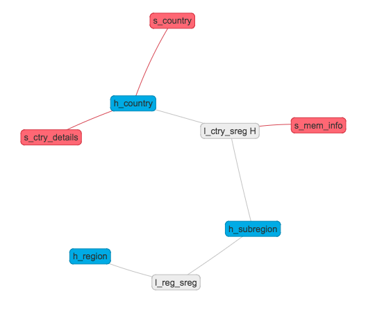
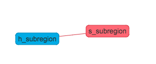

# Example 1: Hierarchy with Satellites and Links

```
config {
    stage   : file of type german_csv
    load    : full
}

mapping {
	ctry_code			:	dd=code, kc, cmnt="ISO Code", rn=country_code
	name				:	dd=name
	region				:	dd=name, kc, on=region, oa=reg, ocmnt="Region", rn=reg_key
	subregion			:	dd=name, kc, on=subregion, oa=sreg, ocmnt="Subregion", rn=reg_key
	mem_since			:	dd=date, ls=ctry_sreg, sn=mem_info, cmnt="Begin of membership"
	pop_mio				:	dd=int16, sn=ctry_details, cmnt="Population in Mio."
	pop_mio2            :   dd=int16, sn=ctry_details, cmnt="Population doubled", clc="pop_mio * 2"
}
on=country, oa=ctry, ocmnt="Country",
lk = {
    ctry * -- subregion (ctry_sreg H),
    sreg * -- reg (reg_sreg)
}
```

**Notes**:
* Hub "country" with Business Key "country_code"
* Satellite "country" belonging to Hub "country" with column "name"
* Satellite "ctry_details" belonging to Hub "country" with columns "pop_mio" and "pop_mio2"
* Hub "Region" with Business Key "reg_key"
* Hub "Subregion" with Business Key "reg_key"
* Link (historicized) "ctry_sreg" linking Hub "country" and Hub "subregion"
* Link "sreg_reg" linking Hub "subregion" and Hub "region"
* Satellite "mem_info" belonging to Link "ctry_sreg"
* Column "pop_mio2" is not provided by the source but is calculated using "clc"



# Example 2: Hub and Satellite with ignored column

```
mapping {
    subregion   : dd=name, kc, rn=reg_key
    size        : dd=int16, rn=pop_size
    detail1     : dd=int16, ign
    detail2	: dd=int16, clc="size * 5", cmnt="Size times 5"
} on=subregion, oa=sreg
```

**Notes**:
* Hub "subregion" with Business Key "reg_key" (already present from Example 1)
* Satellite "subregion" belonging to Hub "subregion" with columns "size" and "detail2"
* Column "detail2" is calculated using column "detail1".
* Column "detail1" is ignored and not moved into the Data Vault



# Example 3: Business Vault with Mousetrap trigger

Prerequisite: Example 1 (test_country) and Example 2 (test_subregion) have to be deployed.

```
config {
    stage       : insert
    load        : partial
    trigger     : after test_country, test_subregion timeout 8 hour
}

mapping {
    reg_key         : dd=name, kc
    avg_pop         : dd=decimal_measure_no_default, sn=subregion_business_vault
}
on=subregion,
oa=sreg

sql{"
    select h_subregion_reg_key reg_key, round(avg(h_country_s_ctry_details_pop_mio), 2) avg_pop
    from chef_served.v_latest_l_ctry_sreg
    group by h_subregion_reg_key
"}
```

**Notes**

* Hub "subregion" with Business Key "reg_key" (already present from Example 1 and 2)
* Business Vault Satellite "subregion_business_vault" belonging to Hub "subregion" with column "avg_pop"
* Mapping is triggered after the execution of "test_country" and "test_subregion" or if the timeout of 8 hours is reached
* SQL is used to realise the Business Vault transformation utilising the View access layer

# Example 4: Cron scheduled data via JDBC

```
config {
    stage: import from jdbc datachef_repository
    load: full
    trigger: cron "0/30 * * * * ?"
}

mapping {
    name            : dd=name, kc, cmnt="Name of the Data Domain"
    default_value   : dd=name, cmnt="Default if null"
    sql_type        : dd=name, cmnt="Technical SQL type"
} on=data_domain, ocmnt="Data Domain"

sql{"
    select `name`, `defaultValue`, `sqlType`
    from `datachef`.`DataDomain`
"}
```

**Notes**
* Hub "data_domain" with Business Key "name"
* Satellite "data_domain" with columns "default_value" and "sql_type"
* Load type is full; delete detection is enabled
* Data get's imported every 30 seconds triggered via CRON
* DWH must have a configured JDBC connection named "datachef_repository"
* SQL must be compatible with target database
