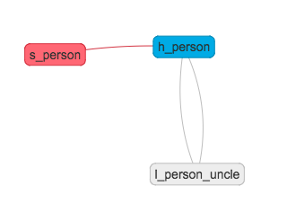

# Mapping structure

A Mapping file describes a column-based source (typically a CSV file). Configuration properties go in the "config" block. The "mapping" block describes each column with the column's name, a colon followed by the column's properties. Mapping properties can be provided after "}" brace of the "mapping" block.

```
config {
	// See "Config properties"
}

mapping {
	col1 : dd=dd1, kc
	col2 : dd=dd1,
} on=test
```

In the example above, a source with two columns "col1" und "col2" is described. The definition of a Data Domain (dd) is required for every column. Also, the object name (on) is inherited since it's defined as Mapping property. This example will create a Hub named "test" with "col1" as Business Key and a Satellite named "test" containing "col2".

## Config properties

### Staging

#### Staging via files

```
config {
	(...)
	stage   : file [of type $csv_type]
	(...)
}
```

```$csv_type``` is optional. Default value via ```sink.config.properties```.

#### Staging via IMPORT (from connection)

Instead of importing data from CSV files, Data Chef can import data from a provided connection if set to staging mode "import. ```$connection_name``` has to match the name of a created and configured connection. Connections can be of type ```jdbc```, ```ora``` or ```exa```. Additionally, the "sql" block has to be provided. Data Chef will execute the provided SQL statement with the IMPORT statement. Also, the provided SQL statement has to be compatible with the target database reached with the specified connection.

```
config {
	(...)
	stage: import from ( jdbc | ora | exa ) $connection_name
	(...)
}

mapping { /* ... */ }

sql { "SELECT something FROM somwhere" }
```

#### Staging via INSERT AS SELECT

```
config {
	(...)
	stage : insert
	(...)
}

mapping { /* ... */ }

sql { "SELECT something FROM chef_served.s_foo..." }
```

Besides CSV files and connections to foreign databases, Data Chef can also stage data via INSERT AS SELECT. The INSERT AS SELECT statement will be executed directly on the DWH and can be used for the creation of Business Vault transformations or to query Virtual Schemas. ```$sql``` will be replaced with the String specified in the "sql" block of the Mapping:

```
INSERT INTO $schema_name_raw.$mapping_name
	AS $sql
```

**Important**: The result set of the provided SELECT statement has to match the column definition in the "mapping" block.

### Triggering

#### Via file

If "stage" is not provided or set to "file" the Mapping can only be trigged via the placement of a file in the Sink directory.

#### Via CRON

If staging mode is "insert" or "import" a CRON trigger is supported. Add the following to the "config" block:

```
config {
	stage	 	: insert
	trigger	: cron "0/30 * * * * ?"
}
```

The CRON expression is provided as String and follows the [QUARTZ syntax](http://www.quartz-scheduler.org/documentation/quartz-2.x/tutorials/crontrigger.html).

##### Changing CRON

Changing CRONs can be done by performing a mapping rollback, if a complete reload of data is an option. For all other cases, a manual change in Data Chefs repository is the option to choose.

You can find the CRON settings in table "datachef.Mapping". Simply update column "cronExpression" with the new CRON expression und restart the Data Chef.

#### Via Mousetrap

If staging mode is "insert" or "import" a Mousetrap trigger is supported. With a Mousetrap trigger you can specify a list of Mappings that have to be executed witihin a defined timeout before the current Mapping.

```
config {
    stage       : insert
    trigger     : after test_country, test_subregion timeout 20 (sec | min | hour | day)
}
```

Mousetrap triggers are started when one of the provided Mappings is successfully executed. The trigger will execute the current Mapping if all defined Mappings are successfully executed before the timeout is reached. If the timeout is reached the execution of the current Mapping will be trigged even if not all Mappings in the list were executed successfully beforehand. After the execution the Mousetrap will reset and stay inactive until one of the specified Mappings starts it again.

The timeout is defined as integer with the time unit ```sec```, ```min```, ```hour``` or ```day```.

### Load types

Data Chef supports the following load types:

* Full
* Partial (default)

Add the following to the "config" block to enable full load:

```
config {
	load: full
}
```

If full load is enabled Data Chef will executed additional UPDATE statements end dating those rows in Satellites that are not appearing in stage.

## Properties

* "Strings" have to be surrounded by double qoutes.
* IDs: only lowercase charactes, underscores and numbers.

### Mapping properties

Each column inherits the Mapping properties. Mapping properties will be provided on mapping level after the closing curly brace of the "mapping" block.

| Property      | Description
| ------------- |-------------|
| on | Object's name (ID) |
| oa | Object's alias, *only one per object* (ID) |
| ocmnt | Object's comment, *only one per object* (String) |
| lk | See Link definition, (not inherited) |

### Column properties

| Property      | Description
| ------------- |-------------|
| on | Object's name (ID) |
| oa | Object's alias, *only one per object* (ID) |
| kc | Key column for the referenced object (no value) |
| ocmnt | Object's comment, *only one per object* (String) |
| cmnt | Columns comment (String) |
| rn | Rename column (ID) |
| ign | Ignore column (no value) |
| dd | Columns Data Domain (required) (ID) |
| rl | Role in relation to referenced object (ID) |
| clc | SQL snippet (String) |
| sn | Satellite's name (ID) |
| ls | Name of the Link the column belongs to (ID) |

### Link definition

"lk" defines Links with Driving Keys and names: The name of the Link has to be provided. Driving Keys are marked with a "*" after each Hub which is part of the Driving Key. If the Driving Key is unknown all Hubs have to be marked as driving. If a Link should be historicized an "H" can be added after the name. A historicized Link gets an additional Satellite (```s_$link_hist```) end dating the relationships of the linked Hubs according to the Driving Key. If in load type "full" delete detection will be activated on those Satellites as well.

```
lk= {
 hub1 * -- hub2 (link1),
 hub3 * -- hub4 (link2 H),
}
```

In the example above, two Links are defined. "link1" links "hub1" and "hub2" marking "hub1" as Driving Key. Secondly, "link2" is historicized and links "hub3" and "hub4" marking "hub3" as Driving Key.

#### Self-recursive link definition

```
lk= {
 hub1 * -- hub1_rl1 (link1)
}
```

#### Multiple references to the same hub

```
lk= {
 hub1 * -- hub2 +hub2_rl1 (link1)
}
```

### Role definition

Hubs and Satellites can have multiple roles as the following example illustrates:

```
mapping {
	person_id 	: dd=id, kc, cmnt="ID of a person"
	person_name	: dd=name
	uncle_id	: dd=id, kc, rl=uncle, rn=person_id, cmnt="Foreign Key to person_id"
	uncle_name	: dd=name, rl=uncle, rn=person_name

} on=person, lk= {
   person * -- uncle (person_uncle)
}
```



In the example above, object "person" is defined resulting in the creation of a Hub "person" and a Satellite "person". Additionally, the source provides the columns "uncle_id" and "uncle_name" as denormalised self-reference which is modelled as Link "person_uncle". The Mapping will create DML statements for the default role populating Hub "person" and Satellite "person" with columns "person_id" and "person_name" as well as statements for the role "uncle" using the columns "uncle_id" as "person_id" and "uncle_name" as "person_name".
